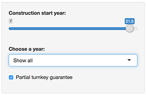

## Insight for the layperson

The features of this app are fairly limited. It was purpose built to enable the __Citizen Data Scientist__ to explore some of the information available in the Nuclear dataset.
(More about the data on the next slide.)
The user interface provides simple means to filter the dataset based on only 3 criteria and display the overview in a barchart instantaneously.
The app is available here:  https://sandor.shinyapps.io/CourseProject/


Image source: https://strongsuitblog.files.wordpress.com/2014/05/i-have-no-idea-what-im-doing.jpg

---

## The Dataset

The data is available in the "boot"" R package and it was originally obtained from 
"Cox, D.R. and Snell, E.J. (1981) Applied Statistics: Principles and Examples. Chapman and Hall."
This app uses the below columns from the dataset:
* cost The capital cost of construction in millions of dollars adjusted to 1976 base.
* date The date on which the construction permit was issued. The data are measured in years since January 1 1990 to the nearest month.
* t1 The time between application for and issue of the construction permit.
A quick summary of the data:
* pt A binary variable where 1 indicates those plants with partial turnkey guarantees.

---

## The Dataset - ctd.

A quick summary of the data:
```{r echo=FALSE }
library("boot")
head(nuclear)
summary(nuclear$cost)
summary(nuclear$t1)
```

---

## Features and UI

The user can easily change the displayed plot with three very simple controls: 
* A slider, to limit the records to those with a delay under a specific value
* A drop-down box to set the date in which the construction started
* A checkbox to consider only those powerplants for which the builder provided a partial turnkey guarantee.



---

## Features and UI - ctd.
A sample plot without any filters.
```{r echo=FALSE }
myplot <- barplot(nuclear$t1, nuclear$cost, xlab= "Time between application for and issue of the construction permit", ylab= "Cost", col='red')
axis(1,at=myplot,labels=subset_data$t1)
```


